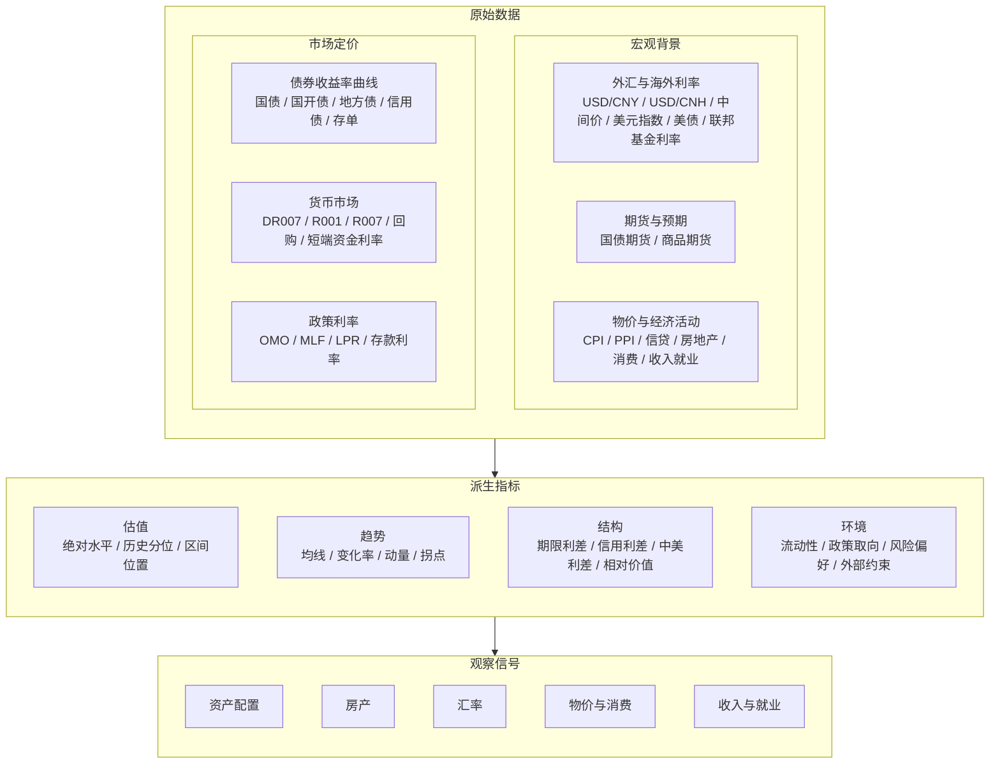

# Macro Signals for Life

面向生活的宏观信号。

这是一个基于 Google Apps Script 和 Google Sheets 的宏观观察项目，目标是把利率、流动性、信用等市场数据整理成普通人也能长期跟踪的观察信号。
重点不是预测短期涨跌，而是识别当前环境变化，并把它转成更容易理解的提示。

- 原始数据：国内利率、政策利率、美国与美元、以及其他宏观变量
- 派生指标：重点提炼估值、趋势、利差、相对价值和流动性环境
- 观察信号：最终落到资产配置、债券、房产、汇率和日常决策

## 当前信号

- **久期信号**：判断更适合长久期、中性还是偏防守
- **曲线信号**：判断期限结构偏平、偏陡或中性
- **利率债相对价值信号**：观察国开债、地方债相对国债的性价比
- **信用信号**：观察高等级信用、信用下沉、短端信用的相对吸引力
- **环境信号**：识别资金面、信用环境和整体市场状态
- **配置倾向**：给出长久期、中久期、短久期、高等级信用、信用下沉、现金等方向的提示性权重

## 关注的问题

- 利率环境偏松还是偏紧
- 债券市场更接近顺风、震荡还是逆风
- 信用环境是否改善或恶化
- 当前哪些变化值得普通人提高关注

## 原则

- 先观察，再判断
- 少预测，多识别状态
- 面向普通人可用
- 信号是提醒，不是命令

## 提醒

本项目用于研究记录和观察辅助，不构成投资建议。

## Overseas macro secrets 配置

`原始_海外宏观` 使用两个外部数据源：

- `FRED_API_KEY`
- `ALPHA_VANTAGE_API_KEY`

不要把真实密钥明文提交到仓库里。推荐做法：

1. **Apps Script 运行时**：把密钥保存到 **Script Properties**
2. **GitHub**：把密钥保存到 **GitHub Secrets**
3. 通过仓库里的 `setApiKeysFromParams(fredApiKey, alphaVantageApiKey)`，由 GitHub Actions 自动把 Secrets 写入 Script Properties
4. **首次使用前**：把 Apps Script 项目部署为 **API executable**，并确保 `appsscript.json` 已包含 `executionApi` 配置

建议在 GitHub 仓库中配置这些 secrets：

- `GAS_SCRIPT_ID`
- `CLASP_CLIENT_ID`
- `CLASP_CLIENT_SECRET`
- `CLASP_ACCESS_TOKEN`
- `CLASP_REFRESH_TOKEN`
- `FRED_API_KEY`
- `ALPHA_VANTAGE_API_KEY`

如果还没有配置好密钥，`fetchOverseasMacro_()` 不会中断主流程，只会在日志里提示缺少哪些 key，并跳过这张表的抓取。
